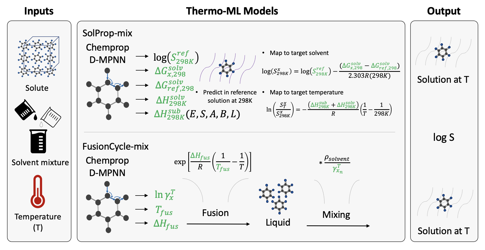

# Predicting solubility curves in solvent mixtures using thermodynamic cycles and machine learning

<p align="center">
  
</p>

This repository contains the code used in our work on predicting solubility of organic compounds in binary solvent mixtures using machine learning.

## Contents

- **`SolProp_ML/`** — The SolProp-mix software tool used in this work along with the weights. See the README inside that folder for installation instructions.
- **`DirectML/`** — Python scripts for Chemprop and fastsolv, both extended to handle mixed-solvent systems, along with the training data.

## Citation

If you use SolProp-mix, please cite our work:
**[Predicting solubility curves in solvent mixtures using thermodynamic cycles and machine learning](https://doi.org/10.26434/chemrxiv.15003912/v2)**
Simona Buzzi, Emad Al Ibrahim, Ulderico Di Caprio, William H. Green, Florence Vermeire — *ChemRxiv*, 2026

```bibtex
@article{Buzzi2026solubility,
  author  = {Simona Buzzi and Emad Al Ibrahim and Ulderico Di Caprio and William H. Green and Florence Vermeire},
  title   = {Predicting solubility curves in solvent mixtures using thermodynamic cycles and machine learning},
  journal = {ChemRxiv},
  year    = {2026},
  doi     = {10.26434/chemrxiv.15003912/v2}
}
```
